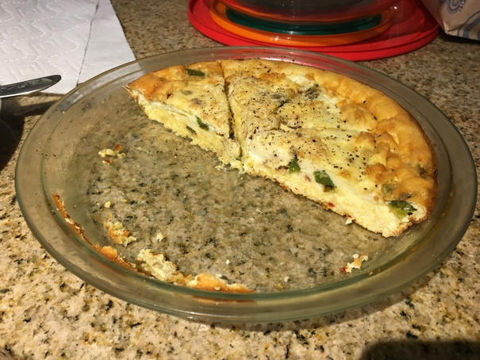

# Mushroom Cheddar Quiche

## ingredients

* 6 eggs
* 1 cup heavy cream
* 8 ounces finely shredded sharp cheddar cheese
* 1/2 pound fresh mushrooms
 * Worth it to try and get pre-sliced mushrooms, otherwise slice ~3-5mm wide
* 2 1/2 to 3 1/2 tablespoons butter
 * Kerrygold is best
* 1/2 teaspoon salt
* Pepper
* Garlic powder
* [Mrs. Dash Extra Spicy](http://a.co/3t9uTQl)
 * Can be substituted if you hate freedom
* Onion powder

## tools

* Large non-stick pan
* 1.5Qt or larger bowl
* Glass pie dish

## instructions

### pre

1. Pre-heat oven to 350°
2. Warm the pie dish on the range over medium-ish heat until it's hot enough to melt butter
3. Cover the bottom and sides of the pie dish with melted butter
4. Remove dish from heat and allow to cool

### prep

Est. time: 10 min

1. Melt 2 tbps butter in a large pan over medium heat
2. Sauté mushrooms 4-6 minutes or until turning brown and tender, season with salt, pepper, garlic and onion powders while cooking
3. Crack the eggs into the bowl
4. Mix heavy cream and seasonings into the bowl, beat until thoroughly combined
5. Gingerly and evenly spread the cheese around the pie dish
6. Place mushrooms on top of cheese
7. Pour egg and creme mixture over the cheese

### cook

Est. time: 35-45  min
> depending on: Inserting a knife in the center comes out clean

1. Place pie dish on the center rack
2. Cook at 350° for approximately 35-45 minutes

### modifications

Mushrooms can be replaced or augmented with nearly any vegetable or soft food:
* Lightly pan fry until tender and season as desired
* Cubed ham works great
