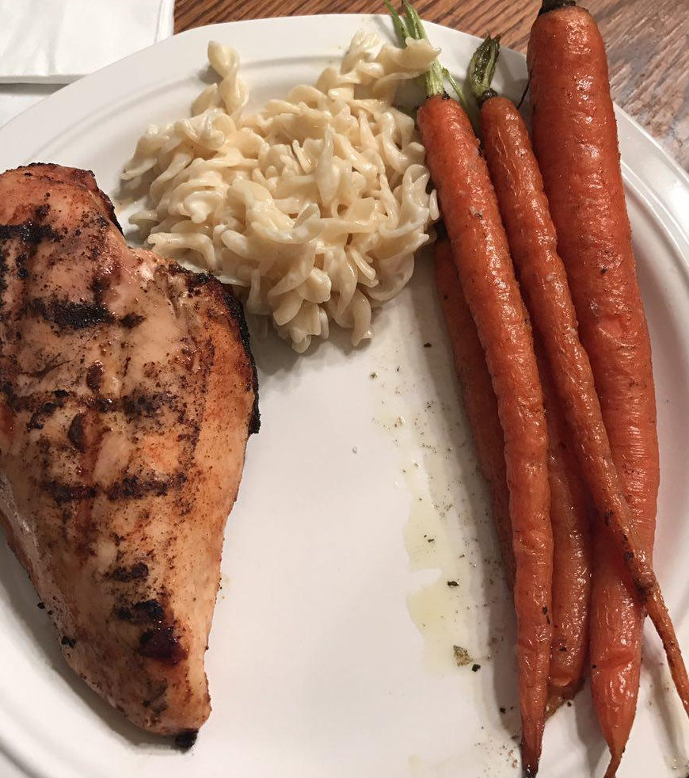

# Oven-roasted Carrots

> prepared by @jawsome

## ingredients

* carrots
  * large
  * even-sized
* olive oil
* dill weed
* thyme
* parsley 

## tools

* half-sheet baking pan
* aluminum foil to cover

## instructions

### pre

1. pre-heat oven 400°F using setting broil

### prep

Est. time: 2-5 min

1. wash carrots thoroughly
2. if (very hard dirty skin) 
  * consider peeling
3. in a flat, long dish/bowl (you want them to be able to lay down) consolidate seasonings and oil
4. coat carrots in oil+seasoning mix (rolling around is ok)
5. cover a flat baking sheet in foil 
6. remove coated carrots from bowl, place on foiled baking sheet

### cook

Est. time: 15-20  min
> depending on: size of carrots (touch with fork to test softness)

1. place baking sheet on middle rack
2. wait 5 minutes
3. remove sheet from oven
4. rotate carrots
  * add more oil/roll around in the process
  * note: be gentle, don't want them falling apart potentially
5. repeat 2-4 until soft to fork-touch

### modifications

* sweeten
  * prep
    1. after placing on baking sheet, sprinkle with brown sugar
